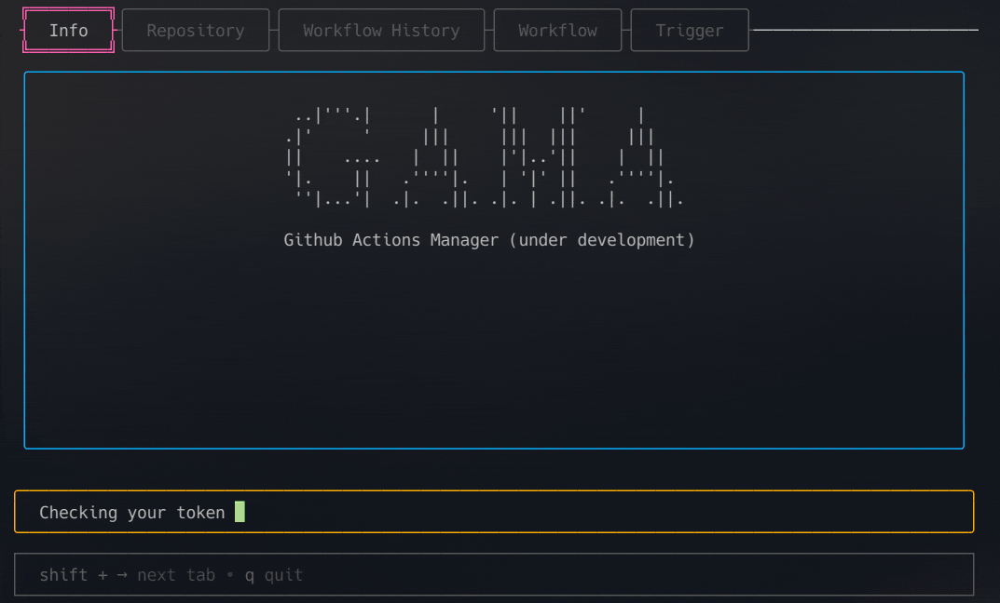

# GitHub Actions Manager (GAMA)

GAMA is a powerful terminal-based user interface tool designed to streamline the management of GitHub Actions workflows. It allows developers to list, trigger, and manage workflows with ease directly from the terminal.

<a href="https://github.com/termkit/gama" target="_blank"></a>
<a href="https://goreportcard.com/report/github.com/termkit/gama" target="_blank"></a>
<a href="https://github.com/termkit/gama" target="_blank"></a>



## Key Features

- **Extended Workflow Inputs**: Supports more than 10 workflow inputs using JSON format.
- **Workflow History**: Conveniently list all historical runs of workflows in a repository.
- **Discoverability**: Easily list all triggerable (dispatchable) workflows in a repository.
- **Workflow Management**: Trigger specific workflows with custom inputs.

## Getting Started

### Prerequisites

Before using GAMA, you need to generate a GitHub token. Follow these [instructions](docs/generate_github_token/README.md) to create your token.

### Configuration

#### YAML Configuration

Place a `~/.config/gama/config.yaml` file in your home directory with the following content:

```yaml
github:
  token: <your github token>

keys:
  switch_tab_right: shift+right
  switch_tab_left: shift+left
  quit: ctrl+c
  refresh: ctrl+r
  enter: enter
  tab: tab
```

#### Environment Variable Configuration

Alternatively, you can use an environment variable:

```bash
GITHUB_TOKEN="<your github token>" gama
```

If you have the [GitHub CLI](https://cli.github.com/) installed, you automatically insert the var via:

```bash
GITHUB_TOKEN="$(gh auth token)" gama
```

This will skip needing to generate a token via the GitHub website.

**NOTE: You may still need to generate a token via the GUI if you run into errors**

## Build & Installation

### Using Docker

Run GAMA in a Docker container:

```bash
docker run --rm -it --env GITHUB_TOKEN="<your github token>" termkit/gama:latest
```

### Download Binary

Download the latest binary from the [releases page](https://github.com/termkit/gama/releases).

### Build from Source

```bash
make build
# output: ./release/gama
```

---

## Contributing

Contributions are what make the open source community such an amazing place to learn, inspire, and create. Any contributions you make are **greatly appreciated**.

## License

Distributed under the GNU GENERAL PUBLIC LICENSE Version 3 or later. See [LICENSE](LICENSE) for more information.

## Contact & Author

[Engin Açıkgöz](https://github.com/canack)

## Stargazers over time

[](https://starchart.cc/termkit/gama)
