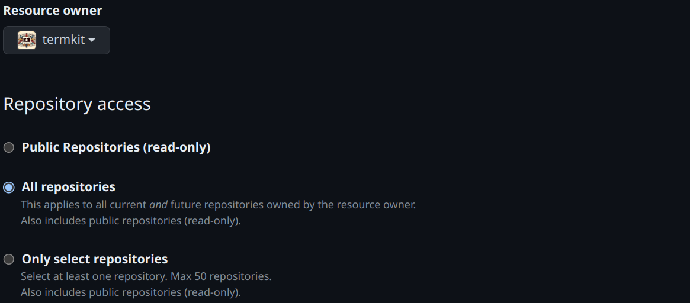
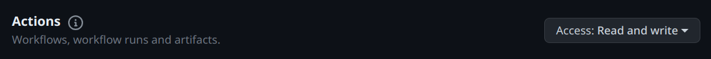
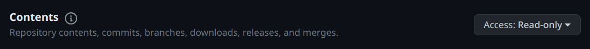
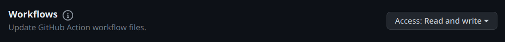

### Generate GitHub Token from GAMA ("Fine-Grained Token")

Generate a GitHub token with specific permissions for optimal use with GAMA. Follow these steps:

1. **Open the Fine-Grained Token Page**
    - Navigate to the fine-grained token page.
    - Click on the "Generate new token" button.

2. **Choose Repositories**
    - Decide the scope of the token: `All repositories` or `Only selected repositories`.
      

3. **Set Required Permissions**
    - Scroll through the permissions list and enable the following:

        - **First Permission**: Necessary to trigger workflows.
          

        - **Second Permission**: Essential to list triggerable workflows.
          

        - **Third Permission**: Required to read repository contents, enabling workflow triggering.
          

4. **Finalize**
    - After setting the permissions, complete the token generation process.

Now, you can utilize this token with GAMA to manage GitHub Actions workflows effectively.
